## Integração contínua com Jenkins e Docker

Neste tutorial vamos criar um ambiente Jenkins utilizando o Docker para realizar a construção de uma aplicação Java, mostrando assim o conceito de build automatizado. O servidor irá rodar localmente e o código que será utilizado será uma aplicação de linha de comando do Spring Boot que estará versionado no GitHub. Este ambiente também poderá ser utilizado para testar plugins e outros recursos do Jenkins.

### 1. Instalando o Docker

Para instalar o Docker, siga os procedimentos indicados no guia de instalação para o seu sistema operacional, disponível em https://docs.docker.com/install/

### 2. Criando o container Docker Jenkins

Após realizada a correta instalação do Docker no seu computador abra o terminal ou o console do seu sistema operacional e crie uma imagem baseada na [imagem oficial do Jenkins no dockerhub](https://hub.docker.com/_/jenkins), utilizando o seguinte comando:

```
docker run -p 8080:8080 --name jenkinsci jenkins/jenkins:lts
```

Este comando instrui o Docker a criar uma imagem local baseada na imagem ```jenkins/jenkins:lts```, instrui o docker a realizar o mapeamento da porta 8080 do container para a porta 8080 do host (argumento ```-p```) e nomeia o container como ***jenkinsci*** através da opção ```--name```.

O docker realizará o download da imagem e criará o container, conforme a figura abaixo:


Durante a execução da imagem do Jenkins, é exibido uma senha que é requerida para o setup inicial da aplicação, copie a senha e cole quando solicitdao na interface web.

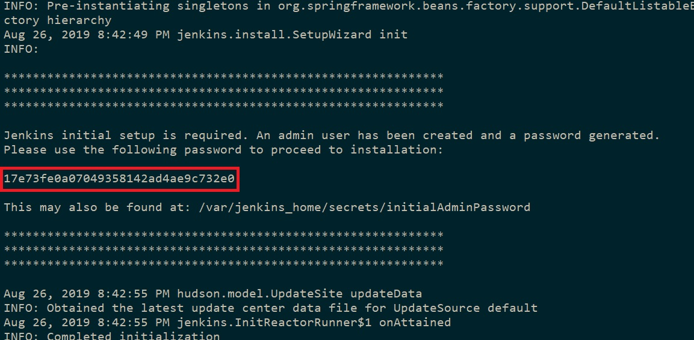

Ao acessar o endereço http://localhost:8080 você verá a tela abaixo, copie a senha do passo anterior e clique em ***Continue***.

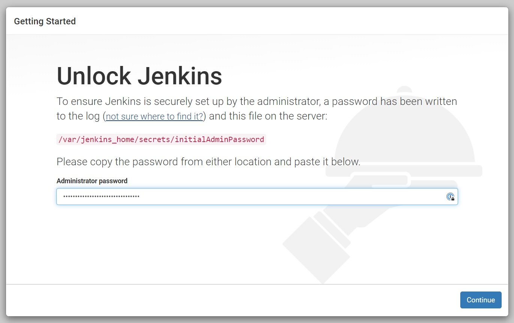

A próxima etapa do setup será a customização do Jenkins, para o nosso tutorial, seguiremos com os plugins sugeridos, ao clicar em ***Install suggested plugins***, conforme a figura abaixo:

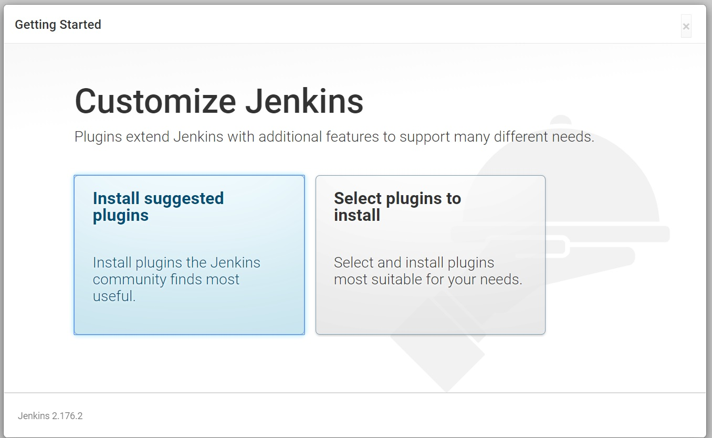

Os plugins sugeridos são instalados automaticamente:

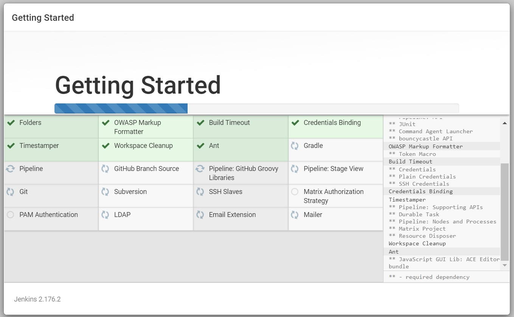

Após a instalação dos plugins será exibida a tela abaixo para a criação do usuário de administração e clique em ***Save and Continue***

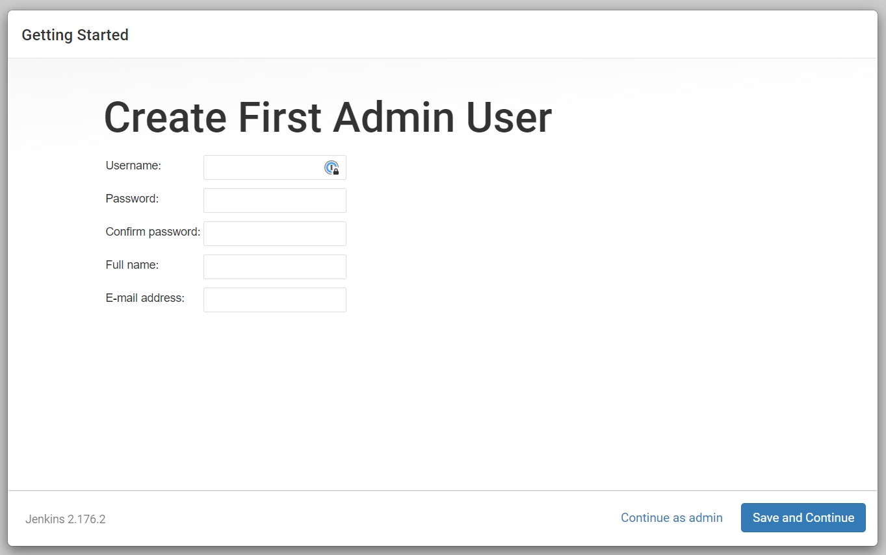

Na tela de configuração da instância, basta clicar em ***Save and Finish***

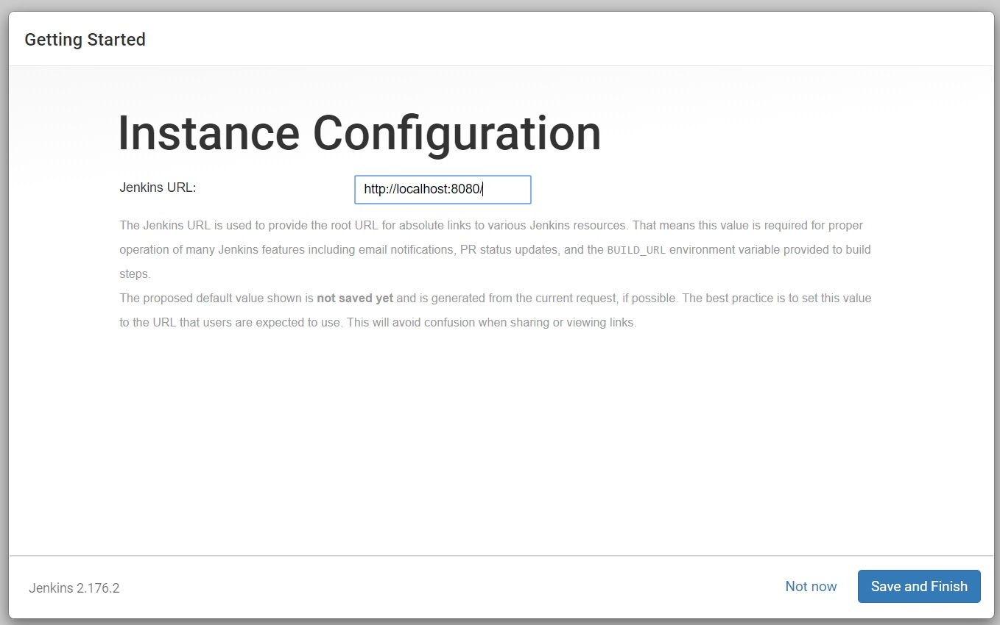

Com o Jenkins configurado, clique em ***Start using Jenkins***

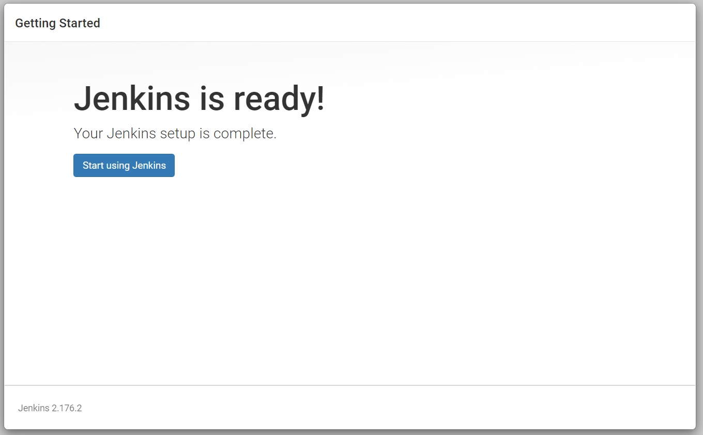

Pronto, o nosso Jenkins já está sendo executado corretamente!

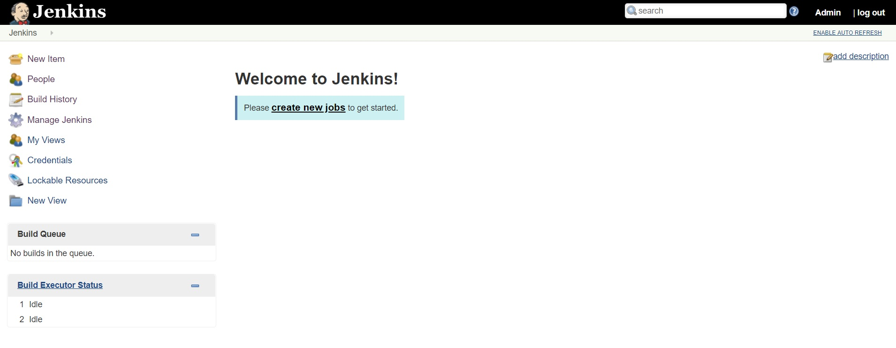

### 3. Configurando o Jenkis para a aplicação

Após o nosso Jenkins estar rodando, vamos configurar alguns plugins necessários para a construção de nossa aplicação, no menu lateral clique em ***Manage Jenkins*** e na tela de Gestão clique em ***Manage Plugins***.

Clique na aba ***Available*** e busqye por **Maven**, selecione ***Maven Integration*** e clique em ***Install without restart***. O plugin será instalado, clique em ***go back to top page***.

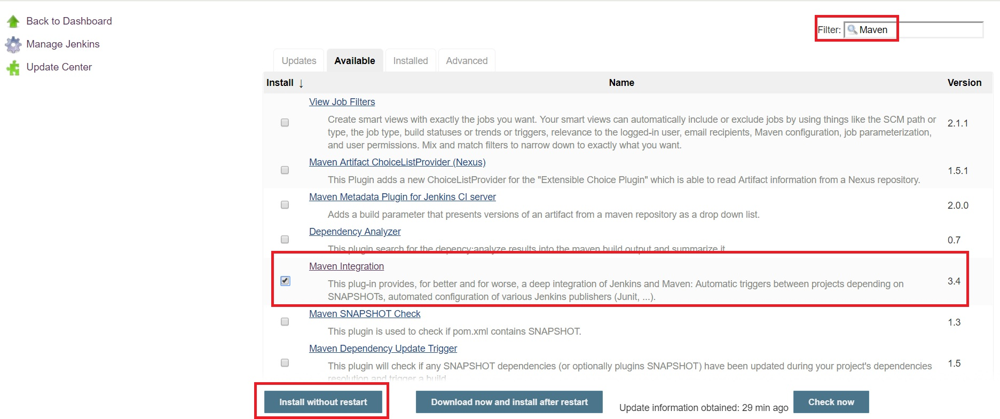

Após este passo, no menu lateral clique novamente em ***Manage Jenkins*** e selecione a opção ***Global Tool Configuration*** para configurarmos o Java JDK e o Maven que serão utilizados para o build do nosso projeto.

#### Adicionando Java JDK 8

Para adicionar automaticamente o Oracle Java JDK 8 clique no botão **Add JDK**, selecione o item na caixa ***Version***, marque a caixa que aceita os temos de contrato. Para instalar automaticamente você precisa de uma conta Oracle, se não tiver ainda, crie a conta e clique no link **Please enter username/password** para adicionar os dados. Dê também um nome para a JDK conforme a imagem abaixo:

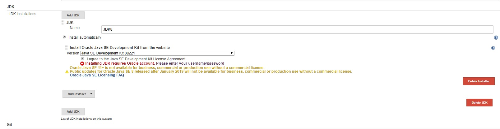

#### Adicionando Maven

Para adicionar o Maven, na mesma página, vá até a seção Maven e clique no botão **Add Maven** conforme a figura abaixo:


Clique em **Save** e nossas configurações de JDK e Maven estão prontas.

### 4. Configurando o projeto

Para a configuração do nosso projeto, volte para a página inicial do Jenkis para que possamos realizar os steps necessários para o build da aplicação de exemplo, a aplicação que será construída será uma aplicação simples de linha de comando que utiliza o Spring Boot e está disponível no Github neste [link](https://github.com/jotajr/exampleci).

Na página inicial do maven, clique em **create new job**, e na tela que se abrirá, realize o preenchimento dos dados conforme a imagem abaixo (lembre-se de selecionar Maven Project):

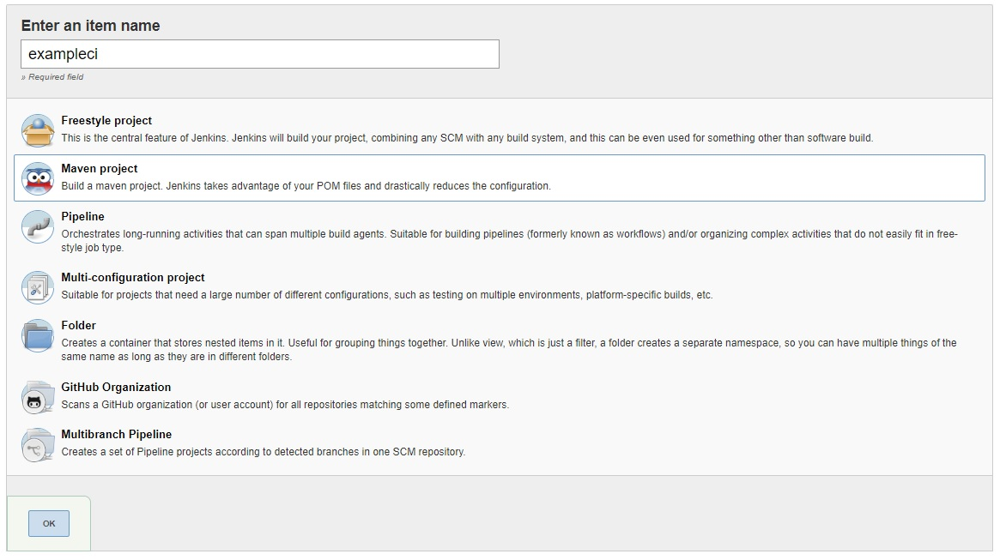

Após clicar em OK, é exibido uma página com as configurações do projeto, conforme a imagem:


Na seção **Source Code Management** adicione a url do repositório GIT e suas credenciais para acesso a este repositório.

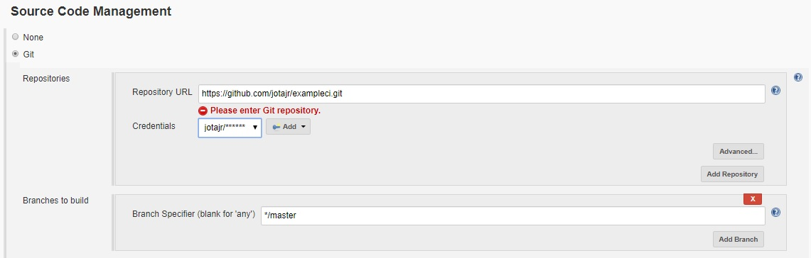

Na seção **Build** adicione os goals ***clean package*** para o Maven

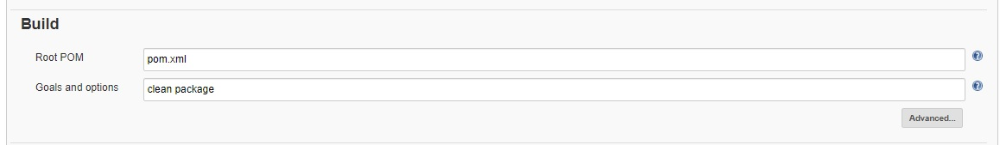

Clique em **Save** e volte para o Dashboar, o seu projeto já deve aparecer nesta tela e já está pronto para ser construído. Clique no projeto e no menu lateral, clique em **Build Now**. Conforme a imagem abaixo:

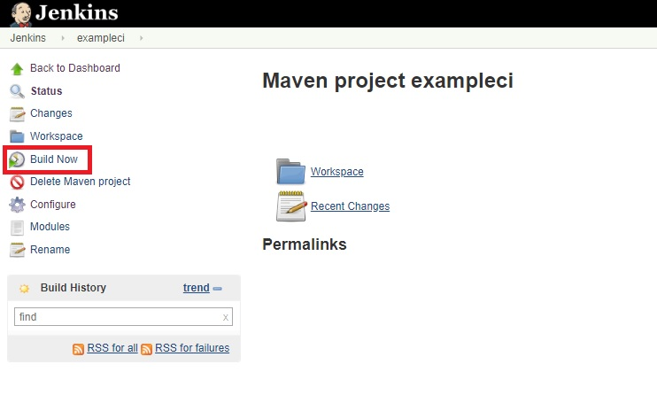

Se tudo ocorrer confome planejado, você pode clicar na barra de status do build no menu lateral e verificar o console do build:

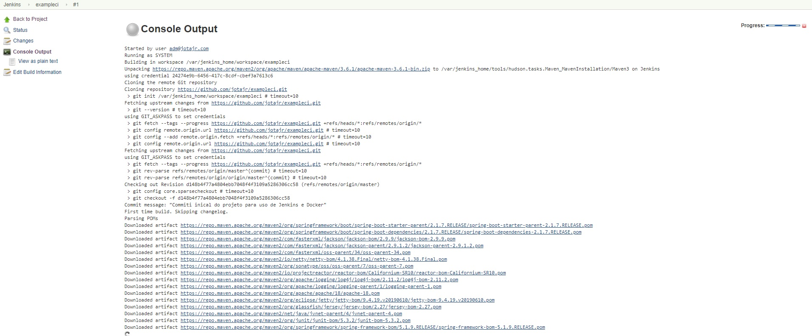

Quando ocorrer o sucesso do build, você poderá voltar para o dashboard e verificar que o build da aplicação foi gerado com sucesso:

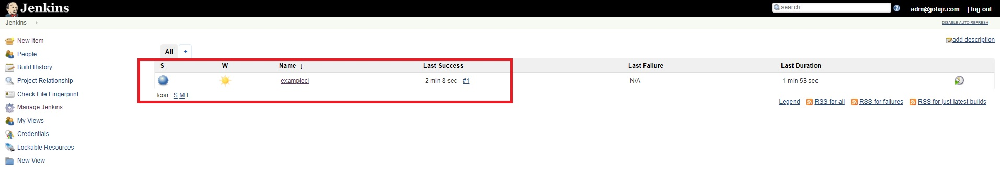

Neste caso foi solicitado ao Jenkins para realizar o build manualmente, mas você pode configurar uma cron string para builds periódicos, configurar uma determinada branch para esta construção e etc.

### 5. Extras

Depois de configurarmos todo o nosso servidor, gostaria de deixar aqui alguns comandos que são úteis para trabalhar com o Docker, como a imagem do Jenkins ainda está sendo executada, você pode parar esta imagem utilizando o comando:

```
docker stop jenkinsci
```

Onde jenkinsci é o nome do container que configuramos inicialmente, para subir novamente o container basta executar o comando:

```
docker start jenkinsci
```

Para listar os containers que estão em execução:

```
docker ps
```

Para listar todos os containers:

```
docker ps -a
```

Para remover o container

```
docker rm jenkinsji
```

E por fim, para remover a imagem do jenkins do seu sistema:

```
docker rmi [imageid]
```

Espero que este tutorial possa ajudar vocês como uma breve iniciação para a utilização do Docker e do Jenkins. Abraços!